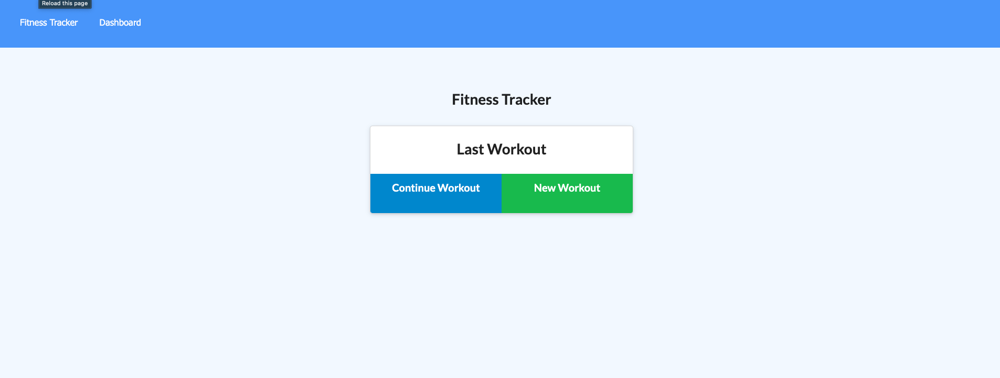
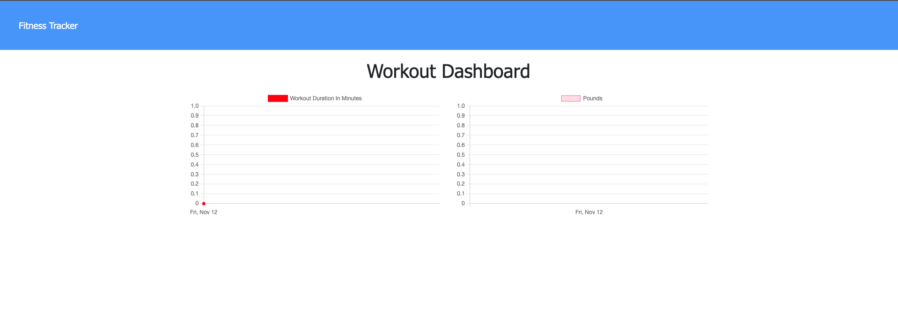

# fitness-tracker

# Description

The Fitness Tracker application was created to help track the distance, duration, and exercises of a workout. This application uses MongoDB, express routing, and Mongoose.

## Link to Application 
[Fitness Tracker!](https://ancient-fjord-45174.herokuapp.com)

# Screenshot :

||

# Installation
 `npm install` to install dependencies.

`node server.js` to start the application.

# Usage

* a user can create a new workout or add to an existing workout.

* Choose workout type from resistance or cardio.

* Fill out exercise details and add it to ongoing workout or mark it complete.

* View your progress over time on the dashboard and current stats on the homepage.

# Technology

* [MongoDB] * [Mongoose] * [Express.js] * [Node.js]

# Contribution

Gavin Reid

[Email](mailto:gavinreid94@gmail.com).